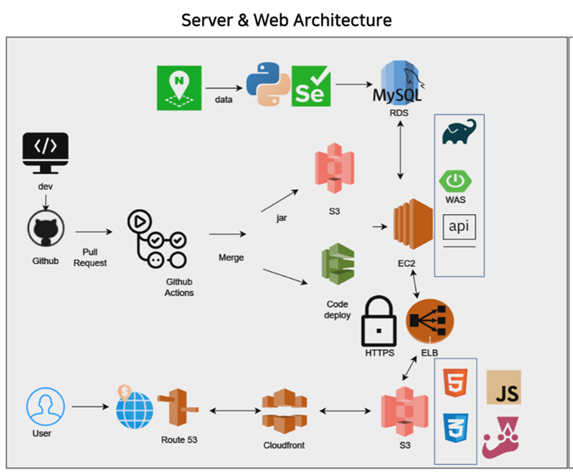

   
  
  <h1>어디카세</h1>
   

## 목차

1. [**웹 서비스 소개**](#1)
2. [**기술 스택**](#2)
3. [**주요 기능**](#3)
4. [**프로젝트 구성도**](#4)
5. [**데모 영상**](#5)
6. [**개발 팀 소개**](#6)

 

## 💁 웹 서비스 소개
성수·홍대·합정·이태원·신사·광화문·명동 등 7개의 인기지역을 위치기반으로 하여 사용자들이 맛집, 카페, 놀거리 일정을 쉽게 짤 수 있도록 돕는 **일정 추천 서비스** 
 
👉 앱으로 코스 생성 후 웹으로 확인할 수 있는 어디카세 웹사이트
 
 

[**🔗 '어디카세' Back-end 저장소**](https://github.com/Eodikase/backend) 👈
 
[**🔗 '어디카세' App 저장소**](https://github.com/Eodikase/EodikaseMultiplatform) 👈

 

## 🛠 기술 스택

### **Front-end**

|  |  |  |
| :----------------------------------------------------------------------------------------------------------------------------: | :--------------------------------------------------------------------------------------------------------------------------: | :-----------------------------------------------------------------------------------------------------------------: |
|                                                             HTML5                                                              |                                                             CSS3                                                             | JavaScript(ES6)                                                                                                                 |                                                         |

|  |
| :---------------------------------------------------------------------------------------------------------------------------: |
|                                                          Axios                                                           |

|  |  |  |
| :----------------------------------------------------------------------------------------------------------------------------: | :--------------------------------------------------------------------------------------------------------------------------: | :-----------------------------------------------------------------------------------------------------------------: |
|                                                             S3                                                              |                                                             CloudFront                                                             | Route53                                                                                                                |

### **Back-end**

|  |  |
| :--------------------------------------------------------------------------------------------------------------------------: | :-----------------------------------------------------------------------------------------------------------------------------: |
|                                                             Java                                                             |                                                           Spring boot                                                           |

|  |  |
| :--------------------------------------------------------------------------------------------------------------------------: | :-----------------------------------------------------------------------------------------------------------------------------: |
|                                                             Python                                                             |                                                           Selenium                                                           |

|  |
| :----------------------------------------------------------------------------------------------------------------------------: |
|                                                             MySQL                                                              |

|  |  |  |
| :----------------------------------------------------------------------------------------------------------------------------: | :--------------------------------------------------------------------------------------------------------------------------: | :-----------------------------------------------------------------------------------------------------------------: |
|                                                             S3                                                              |                                                             EC2                                                             | RDS                                                                                                                |

### **Version Control**

|  |  |
| :---------------------------------------------------------------------------------------------------------------: | :--------------------------------------------------------------------------------------------------------------------: |
|                                                        Git                                                        |                                                         GitHub                                                         |

 

## 📂 프로젝트 구성도

|                              아키텍처(Architecture)                              |
| :------------------------------------------------------------------------------: |
|  |

|                      개체-관계 모델(ERD)                       |
| :------------------------------------------------------------: |
|  |

 

